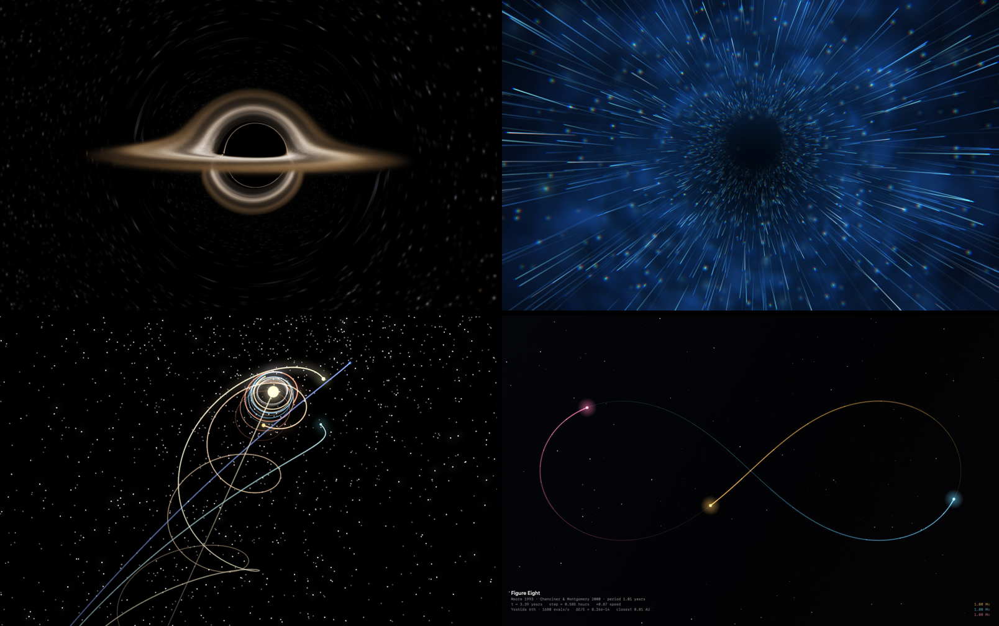

<div align="center">

# Screensavers

**Four native macOS screensavers, sharing one build, signing and release
pipeline.**

[](https://github.com/bensquire/screensavers/actions/workflows/ci.yml)
[](https://www.apple.com/macos/)
[](LICENSE)

<br/>



</div>

|                                              |               |                                                                                                     |
|----------------------------------------------|---------------|-----------------------------------------------------------------------------------------------------|
| **[Gargantua](docs/gargantua.md)**           | Metal         | A spinning black hole, ray-traced along real null geodesics in Kerr spacetime.                      |
| **[Sliders Vortex](docs/vortex.md)**         | Metal         | An endless tunnel of drifting light, with the occasional discharge down the wall.                   |
| **[Solar System](docs/solar-system.md)**     | SceneKit      | The solar system travelling through the galaxy, every planet in its real position for today's date. |
| **[Three-Body Problem](docs/three-body.md)** | Core Graphics | The gravitational three-body problem integrated in real time, in solar masses, AU and years.        |

## Install

1. Download the one you want from
   [Releases](https://github.com/bensquire/screensavers/releases/latest)
2. Unzip, and double-click the `.saver` — or move it to
   `~/Library/Screen Savers/`
3. Pick it in System Settings &rarr; Screen Saver

Each is released separately. All are signed with a Developer ID and notarized
by Apple, so they install without a Gatekeeper warning. Universal — Apple
Silicon and Intel, macOS 14+.

> **If the Options button does nothing**, quit System Settings entirely
> (&#8984;Q) and reopen it with the screensaver you want to configure selected
> first. System Settings binds that button to whichever screensaver was loaded
> when the pane appeared and never rebinds it — nothing a `.saver` bundle can
> influence.

Each screensaver's own page covers what it draws, what its options do, and how
it works.

## Build from source

```sh
make list                      # which savers exist
make build   SAVER=three-body  # build/<saver>/<Name>.saver, ad-hoc signed
make install SAVER=three-body  # build and install to ~/Library/Screen Savers
```

[NOTES.md](NOTES.md) covers the rest: what the four share and why they live in
one repository, the full set of `make` targets, how a release is cut, and where
everything sits.
