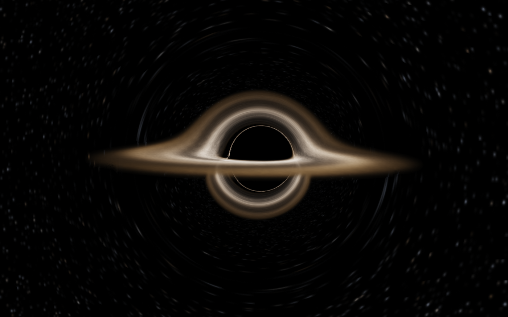

<div align="center">

# Gargantua

**A macOS screensaver: a spinning black hole, ray-traced per pixel along real
null geodesics.**

[](https://github.com/bensquire/screensavers/actions/workflows/ci.yml)
[](https://github.com/bensquire/screensavers/releases/latest)
[](https://www.apple.com/macos/)

[**Download latest &rarr;**](https://github.com/bensquire/screensavers/releases/latest)

<br/>



</div>

## Install

1. Download and unzip `Gargantua.saver`
2. Double-click it, or move it to `~/Library/Screen Savers/`
3. Pick **Gargantua** in System Settings → Screen Saver

Signed with a Developer ID and notarized, so it installs without a Gatekeeper
warning. Universal, macOS 14+. Needs a Metal-capable GPU, which every Mac that
runs macOS 14 has.

## What is actually being computed

Nothing in the picture is drawn. Every pixel fires a ray backwards from the
camera and integrates it as a null geodesic through Kerr spacetime with RK4,
up to a few hundred steps. The shadow, the photon ring, the Einstein ring, the
frame-dragged offset of the shadow, and the disk arcing over the top and under
the bottom of the hole are all consequences of that integration.

The coordinates are **Cartesian Kerr-Schild**, not Boyer-Lindquist.
Boyer-Lindquist is singular on the rotation axis — dφ/dσ carries a
`λ/sin²θ` that diverges there — and no amount of step refinement fixes it,
because the defect is in the chart rather than the integration. Kerr-Schild has
no such singularity anywhere outside the ring:

```
g_uv = η_uv + f k_u k_v,   k_t = 1,   f = 2 M r³ / (r⁴ + a² z²)
```

With energy normalised to 1 and `S = 1 + k·p`, the Hamiltonian is
`2H = -1 + |p|² - f S²`. RK4 then holds the null condition and `L_z` to about
one part in a million with no constraint projection and no turning-point
bookkeeping. Because `f` is the entire deviation from flat space, dialling it
down is an exact continuous interpolation to Minkowski.

**The spin is 0.6**, which is what Double Negative used for the film. That
single number fixes the horizon at 1.8M, the ISCO at 3.83M and the photon
orbits, which is why a spinning hole gets a disk reaching much further in and
running much hotter than a static one would.

### The one deliberate omission

Gravitational redshift is on, because it is simply true: the emitted colour is
`blackbody(T · g)`, so gas deep in the well genuinely looks cooler and
approaching gas genuinely looks hotter. What is off by default is **Doppler
beaming** — the direction-dependent factor that makes the limb rotating toward
you blinding and the other dim red. That asymmetry, and only that, is what
Interstellar dropped because it broke the shot. The options sheet turns it back
on.

The disk's temperature follows Stefan-Boltzmann from a thin-disk emissivity
profile with a stress-free inner boundary, so its colour is not a hand-tuned
ramp: the hottest annulus is placed at a chosen temperature and everything
outside it cools down the Planck locus on its own.

## Options

| | |
|---|---|
| **Pace** | Multiplies every clock at once — camera drift, disk churn, hot spots. |
| **Doppler beaming** | The bright-limb asymmetry described above. |
| **Stars** | The lensed starfield. The reference look has a black sky; the stars are this screensaver's addition, because a black sky takes away the clearest evidence that space is bent. |
| **Render scale** | Fraction of the display the march runs at, when adapting is off. |
| **Adapt render scale** | Drive the scale to hold 60fps instead. |

## How it is drawn

Six passes:

| | |
|---|---|
| **march** | The geodesic integration, into an HDR buffer at render scale |
| **accumulate** | Reproject the previous frame through the previous camera and blend |
| **bright** | Threshold for bloom |
| **down / up** | A five-level bloom pyramid, walked back up additively |
| **streak** | Anamorphic smear — off in the shipped look, and skipped outright when it is |
| **post** | ACES tone map, grade, composite |

**The march is nearly the whole cost**, so it runs at a fraction of the output
resolution and the resolution is driven rather than chosen: an edge-on framing
marches far more disk than a steep one, so no fixed scale is right for every
display and every moment. The controller reads the GPU's own reported elapsed
time per frame — unlike the WebGL original, which had to cross-check two
untrustworthy clocks because wall time is quantised by vsync and the timer-query
extension bracketed CPU gaps too.

**Accumulation is what makes one sample per pixel look clean.** Each frame
jitters its rays by a Halton offset and blends into a reprojected history, with
variance clipping against the 3×3 neighbourhood so moving gas does not ghost.
The blend window is fixed in *seconds*, not frames: a frame-count window would
stretch the effective exposure exactly when the frame rate dropped and the disk
had most time to shear underneath it, turning accumulation into smearing.

**The disk pattern is given a finite memory.** Winding neighbouring radii apart
forever destroys it — the shear grows without bound until the pattern is finer
than a pixel and the prefilter averages it into smooth rings, draining every
trace of turbulence out of the frame within minutes. So the winding is split
into a rigid carrier plus a differential sawtooth of unit slope: the
instantaneous rate at every radius is still exactly Ω(r), and only the
accumulated history is thrown away — under a cross-fade with a second copy half
a cycle out of phase, so the reset is never visible.

### On the port

This was a WebGL2 page in a `WKWebView` until it was rewritten in Swift and
Metal, and the seven GLSL programs became Metal pipelines drawing the same
scene. The result was checked side by side against the original running in a
browser at the same moment.

The reason was not speed — the browser version was already fast. It was memory,
dropping a browser engine and its three helper processes out of a screensaver,
and being able to test any of it. The Kerr geometry the whole scene is built on
now has tests against published values: the ISCO at 3.829M for spin 0.6, the
photon sphere at 3M for a static hole, the horizon at 2M and M at the extremes.
