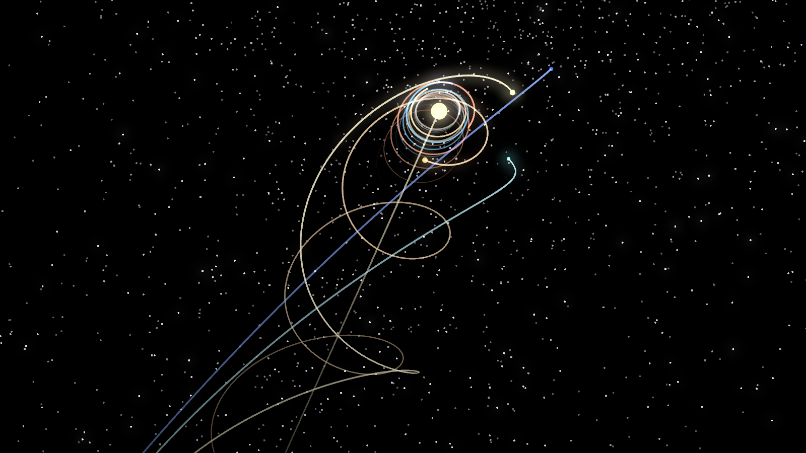

<div align="center">

# Solar System

**A macOS screensaver: the solar system travelling through the galaxy, with
every planet in its real position for today's date.**

[](https://github.com/bensquire/screensavers/actions/workflows/ci.yml)
[](https://github.com/bensquire/screensavers/actions/workflows/release.yml)
[](https://github.com/bensquire/screensavers/releases/latest)
[](https://www.apple.com/macos/)
[](LICENSE)

[**Download latest &rarr;**](https://github.com/bensquire/screensavers/releases/latest)

<br/>



<sub>A frame from the screensaver, rendered by the thing itself.</sub>

</div>

The Sun is moving at 230 km/s around the galaxy and the planets orbit as it
goes, so their real paths are helices rather than circles. That's what this
draws, with the camera flying alongside on an orbit of its own.

Planet directions come from a real ephemeris — accurate to under 16 arcseconds
against JPL Horizons — so the pattern on screen is the actual sky for the
current date, not a decorative one. Distances, sizes and the drift rate are
compressed, because at true scale every planet is smaller than a pixel.
[NOTES.md](NOTES.md) has the full account of what's real and what isn't.

No network access, no data files, nothing to install but the bundle.

## Install

Download and unzip the release from
[Releases](https://github.com/bensquire/screensavers/releases/latest),
double-click `Solar System.saver` (or move it into `~/Library/Screen Savers/`),
then pick **Solar System** in System Settings &rarr; Screen Saver.

Releases are signed with a Developer ID and notarized by Apple, so they install
without a Gatekeeper warning.

Universal binary &mdash; Apple Silicon and Intel, macOS 14+.

## Scale modes

Three, chosen in the **Options…** sheet:

| mode | distances | drift | camera |
|---|---|---|---|
| **Balanced** (default) | `r^0.38` | 0.66% of true | orbits the Sun |
| **True distances** | **exact** | 0.66% of true | orbits the Sun |
| **Bird's eye** | `r^0.38` | **none** | fixed, straight down |

**True distances** puts Neptune genuinely 30× Earth's orbit instead of 3.6×, so
the inner system shrinks to the speck it really is while Uranus and Neptune
sweep out to the edges — the relative spacing most mental pictures get wrong.

**Bird's eye** is an orrery: the camera looks straight down and the galactic
drift is switched off, so each planet closes a complete ellipse instead of
tracing a helix. A diagram rather than a journey.

The sheet writes the moment a choice is clicked. There's also a script, which
sets it and restarts the screensaver host:

```sh
Scripts/scale-mode.sh birds-eye        # or: balanced, true-distances
Scripts/scale-mode.sh                  # report the current setting
```

A very faint date sits in the bottom-right corner. At 0.35 simulated years per
second a minute of screensaver is about 21 years, and the readout is the only
thing on screen that tells you how far ahead of today you are.

## Build from source

Every target takes `SAVER=`, because this repository builds four of them:

```sh
make build   SAVER=solar-system   # "Solar System.saver", universal, ad-hoc signed
make install SAVER=solar-system   # build and install into ~/Library/Screen Savers/
make verify  SAVER=solar-system   # load the built bundle and assert on the frame it drew
make release SAVER=solar-system   # build and package dist/SolarSystem-<version>.zip
make test                         # every saver's tests
make lint                         # swift-format --strict
make format                       # apply swift-format in place
make clean
```

`make install` kills `legacyScreenSaver` and friends before copying, because
the kernel keeps the old bundle's signed pages mapped and will otherwise refuse
to load the replacement.

There's also a windowed app, which is the fast way to iterate on visuals:

```sh
swift run SolarSystemApp                # drag to orbit the camera
swift run SolarSystemApp --help
swift run SolarSystemApp --render out.png --width 1600 --height 900 --at 40
swift run ssverify                      # the real numbers behind the display
```

`--render` needs no window server, so it works over ssh and in CI.

To run lint and tests before every commit:

```sh
git config core.hooksPath .githooks
```

## Layout

```
Sources/
  CAstronomy/          vendored astronomy-engine (MIT, Don Cross) — no data files needed
  SolarSystemCore/     ephemeris, EQJ→galactic rotation, display model    (no rendering)
  SolarSystemRender/   SceneKit geometry + scene graph        (shared by app and saver)
  SolarSystemApp/      windowed app + headless PNG renderer   (fast iteration target)
  SolarSystemSaver/    ScreenSaverView subclass
Scripts/
  build-saver.sh       links a universal MH_BUNDLE .saver — SwiftPM can't emit one
  verify-saver.swift   loads the built bundle and proves it instantiates and draws
```

## Tests

`make test` runs 19 tests: the ephemeris against JPL Horizons fixtures, the
galactic frame's invariants, and the scale presets. `make verify` goes further
and loads the built bundle the way `ScreenSaverEngine` does — resolving the
principal class, instantiating both the full-screen and preview views, and
rendering a frame to prove the scene actually draws. CI runs both, on every
push.

## Releasing

Tag and push; CI builds, signs, notarizes, staples, verifies both
architectures, and publishes the zip.

Each screensaver versions independently, so the tag names which one:

```sh
git tag solar-system-v1.0.0 && git push --tags
```

Signing needs five repository secrets — a Developer ID Application cert
(`SIGNING_CERTIFICATE_P12_BASE64`, `SIGNING_CERTIFICATE_PASSWORD`) and an App
Store Connect key for `notarytool` (`APPLE_API_KEY_BASE64`, `APPLE_API_KEY_ID`,
`APPLE_API_ISSUER_ID`). CI fails rather than publishing if the bundle turns out
not to be Developer ID signed. See [NOTES.md](NOTES.md#releasing) for the ways
those secrets go wrong.

Local `make build` still signs ad-hoc, which is all a local install needs.

## License

MIT — see [LICENSE](LICENSE).

`Sources/CAstronomy` is [astronomy-engine](https://github.com/cosinekitty/astronomy)
by Don Cross, MIT — see [LICENSES/astronomy-engine-MIT.txt](LICENSES/astronomy-engine-MIT.txt).
