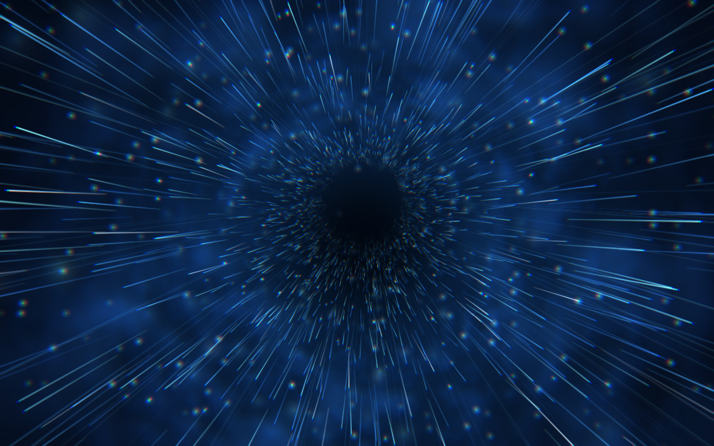

# Sliders Vortex

**A macOS screensaver: an endless tunnel of drifting light, with the occasional
discharge down the wall.**

[**Download latest &rarr;**](https://github.com/bensquire/screensavers/releases/latest)

 

## Install

1. Download and unzip `Sliders Vortex.saver`
2. Double-click it, or move it to `~/Library/Screen Savers/`
3. Pick **Sliders Vortex** in System Settings → Screen Saver

Signed with a Developer ID and notarized, so it installs without a Gatekeeper
warning. Universal, macOS 14+.

## Options

| | |
|---|---|
| **Flow speed** | Multiplier on how fast the tunnel travels. The scene's own slow breathing rides on top, so this shifts the average pace rather than flattening it. |
| **Density** | How many particles. They are evaluated on the GPU, so this trades fill rate rather than processor time. |
| **Lightning** | Whether discharges strike at all. The shockwaves go with them — they exist only as a strike's aftermath. |

## How it works

Nothing walks the particle field. Each of the 5400 particles is a fixed set of
constants — an angle around the tunnel, a radius, a starting depth, a speed, a
wobble — uploaded once into a GPU buffer and never touched again. A particle's
position at any moment is a pure function of those constants and the clock, so
the vertex shader works it out rather than the CPU tracking it. The processor's
whole job each frame is a handful of sines.

Five passes:

| | |
|---|---|
| **background** | Vignette, three fog layers read in (angle, log radius) space so they parallax like texture on a wall, and a star field — one full-screen pass, not four |
| **streak** | The particle field as stretched quads. The vertex shader projects each particle twice, once now and once a moment ago, and lays the quad along the line between, so a streak points the way it is actually travelling |
| **sprite** | Glints and haze puffs, as round points |
| **bolt** | Lightning: a spiral path along the tunnel wall, subdivided four times with midpoint displacement |
| **post** | Chromatic aberration, hue drift, vignette |

The first four accumulate additively into an offscreen texture at 85% of the
target's resolution; only `post` touches the screen. The post pass smears
colour channels apart anyway, so the softening that buys is invisible while it
removes about a third of the pixel work.

Lightning throws off a shockwave, which is never drawn directly — it goes into
a uniform the particle shaders read, so the ring shows up as the particles it
passes over brightening and fattening. That is what sells the tunnel as a
volume of stuff rather than a flat backdrop.

All four savers here run at 30fps. Cost is very nearly proportional to frames
drawn, and nothing in this scene moves in a way that needs more: a streak is
drawn as its own motion blur, spanning 140ms of the particle clock, so
consecutive frames overlap rather than leaving gaps.

### On the port

This was a WebGL page in a `WKWebView` until it was rewritten in Swift and
Metal. The reason was not speed — measured against the browser version it is
roughly a wash — but memory, dropping a browser engine and its three helper
processes out of a screensaver, and being able to test any of it.

Two things are worth knowing if you compare the two side by side:

- The background and post passes measure vertical position from the **bottom**
  of the screen while the particles measure it from the top, so the vignette's
  dark pupil sits mirrored about the horizontal midline from the point the
  streaks actually converge on. That is inherited from the WebGL original,
  where it was almost certainly unintended. It is preserved deliberately, since
  "fixing" it would change what the screensaver looks like.
- Streaks are sized in device pixels and sprites are not, so on a Retina
  display the haze is half the physical size the streaks are drawn against.
  Also inherited, also load-bearing for the look.

Both are marked in the source at the point they matter.
